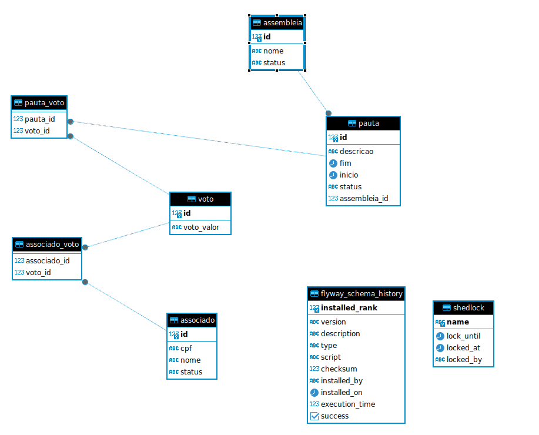
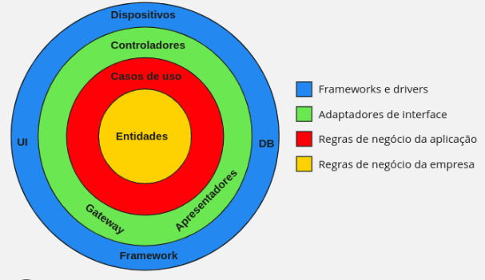

<p align="center">
  <h1 align="center">Assembleia - Teste Tecnico</h1>
</p>

<p align="center">

[](https://opensource.org/licenses/Apache-2.0)


</p>

## Sobre o Projeto

Esse projeto tem como objetivo implementar um sistema para gerenciar a realização de assembleias, pautas e votações por associados.

## Funcionalidades

O sistema permite:

- Cadastrar e consultar associados
- Cadastrar e consultar assembleias
- Cadastrar  e consultar pautas
- Definir ou não o tempo das pautas
- Gerencia automática de encerramento das Pautas
- Registrar votos dos associados nas pautas durante as assembleias
- Gerar relatórios com os resultados das votações
- Capacidade de receber massas de votos por minuto

## Pré-Requisitos

Antes de começar, você precisará ter o Docker instalado em sua máquina.<br>

## Como Rodar

É necessário que você execute o docker compose na raíz do projeto:
`````
docker-compose up -d
`````
Isso irá subir os serviços de Banco de Dados, Kafka, zookeeper e backend.<br>

# [Swagger](http://localhost:8080/swagger-ui/index.html)
`````
http://localhost:8080/swagger-ui/index.html
`````
# [Actuator](http://localhost:8080/actuator)
`````
http://localhost:8080/actuator
`````

## Modelo de Dados


## Modelo da API



